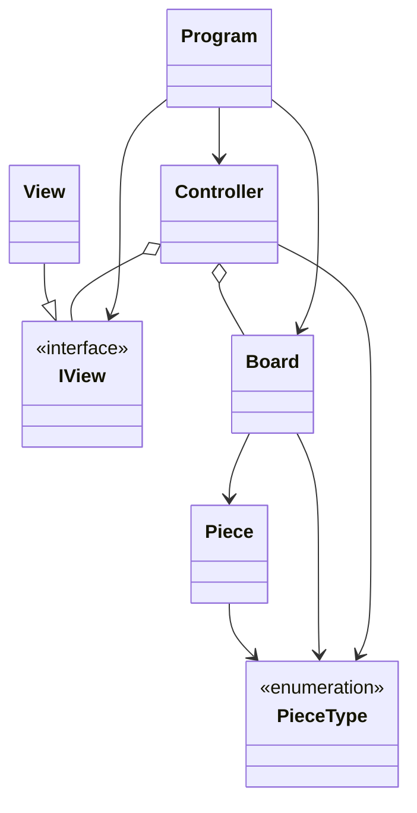

# TriangTriang #

## Autoria: ##
Trabalho realizado por :
 - Gabriela Branco Lindoso de Oliveira (22302388)
 	-  Código
  	-  README.md 
### [» GitHub Link «](https://github.com/GabrielaBranco/TriangTriang "GitHub Link") ###

## Arquitetura da Solução ##
### Descrição da Solução ###
As classes estão organizadas de acordo com o padrão de arquitetura MVC

* Classes:
	* Controller: A classe Controller é responsável por coordenar ciclo do jogo e pelo controle do fluxo de dados.
	* View: Responsável por criar a comunicação entre usuário e interface(UI). Onde está todo tipo de código "console-based".
	* Models:
		* Classes:
			* Piece: Responsável por criar as peças do jogo e definir o seu tipo
			* Board: Responsável por instânciar as peças e manter toda a lógica do tabuleiro. Faz toda a verificação dos movimentos que a peça pode ou não fazer.
		* Enum:
			* PieceType: Define os tipos possíveis de peças.
		* Interfaces:
			* IView: Responsável por estabelecer um contrato com a classe view e definir suas funções

### Diagrama UML de Classes ###

## Referências ##

### Código fornecido por IAS generativas ###
- Utilização do ChatGPT para obter sugestões de código e correções de erro.
(Os códigos retirados do ChatGPT estão com comentários indicando quais são)

### Código aberto reutilizado: ###
- Cores para o console: https://www.dotnetperls.com/console-color
- Códigos unicode: https://commons.wikimedia.org/wiki/Unicode_circle_shaped_symbols
